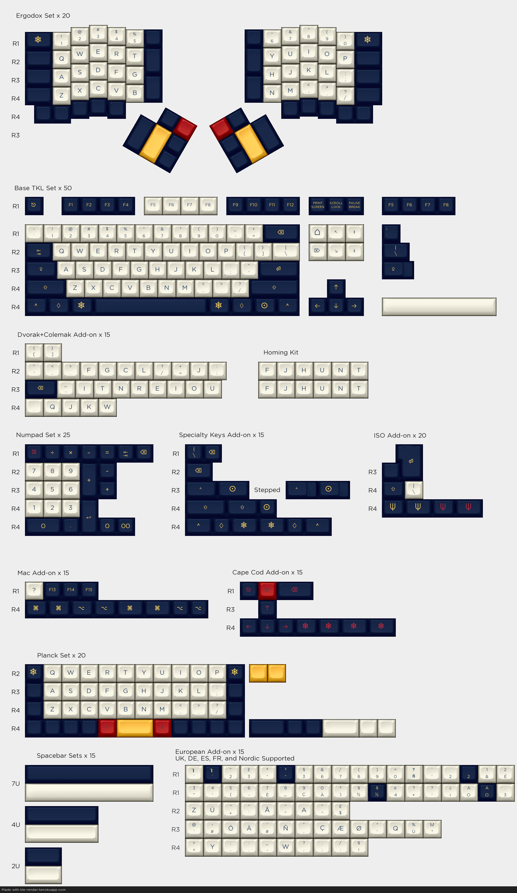

# KLE-Render
> Get prettier images of Keyboard Layout Editor designs

This project uses Python, Pillow, and Flask to serve up more realistic visualizations of custom mechanical keyboard layouts. It works by stretching, tinting, and tiling base images of a 1u keycap. Check it out at [kle-render.herokuapp.com](http://kle-render.herokuapp.com/). You can also see a [sample render](#sample-image) of Nantucket Selectric below.

## Frequently Asked Questions
### What layouts are supported?
KLE-Render should support any layout created with keyboard-layout-editor though some may not render exactly as expected. Specifically, certain very uncommon unicode glyphs may not be displayed. Custom legend images take up the full width of the keycap and only one per key can be used. The base images are only of SA and GMK keycaps, but most layouts in DSA, DCS, OEM, or even beamspring profiles should still look pretty close. Sculpted row profiles are not supported; everything is assumed to be uniform row 3.

### How do I include icons and novelties in my layout?
Many common icons and symbols are part of [Unicode](https://symbl.cc), and can be rendered simply by pasting the appropriate character into the legend text boxes in keyboard-layout-editor. To match the default GMK icons, you can copy characters from the [GMK Icons Template](http://www.keyboard-layout-editor.com/#/gists/afc75b1f6ebee743ff0e2f589b0fc68d). Less common icons are available as part of the Font Awesome or Keyboard-Layout-Editor icon sets under the Character Picker dropdown.

For truly custom legends though, you'll have to use an html image tag, like this one ``. The src parameter here should point to a PNG image with your legend on a transparent background. Note that KLE-Render does not support combining these custom legend images with regular text on the same key, and ignores any sizing or position info - the image is always resized to cover the entire top of the keycap. For reference see the SA and GMK kitting templates below.

### Are custom fonts supported?
There is limited support for custom fonts, but this should be considered an advanced feature. Most layouts won't work without some changes to the custom styling. For more details on how and why see [issue #7](https://github.com/CQCumbers/kle_render/issues/7#issuecomment-880827473).

### What do I do if I get an error page when trying to render?
If you get an internal server error when attempting to render a layout, first make sure that your JSON input is downloaded properly or that your gist url actually exists. If the error persists, please contact me with the gist link or JSON that is causing the problem and I may be able to fix it. I am CQ\_Cumbers on reddit and geekhack.

### Why don't my renders look like the ones on Massdrop?
This tool can generate more realistic renders of arbitrary keyboard layouts, but because it works by stretching and tinting grayscale images, there are many limitations on realism as compared to actual 3D renders. If you're looking for fast and photorealistic visualizations [kbrenders.com](http://www.kbrenders.com) can be a useful resource. For certain custom work, however, you may still have to do post-processing in photoshop or commission a professional like thesiscamper to work with you.

### How do I turn my set design into a group buy?
If you're looking to create a keycap set for a group buy livingspeedbump (creator of SA Jukebox) has a nice [guide](https://www.keychatter.com/2015/10/10/how-to-create-a-keycap-set-for-a-group-buy/) up on keychatter.

## Templates
The following templates have their legend sizes and keycap profiles pre-configured for accurate rendering. Use them as a starting point for your own designs!

- Example Kitting - [SA](http://www.keyboard-layout-editor.com/#/gists/6331e126fa6340711e53a0806d57cde5)/[GMK](http://www.keyboard-layout-editor.com/#/gists/a3a9791b1068f1100b151c33debf660f)
- Mech Mini 2 (40%) - [SA](http://www.keyboard-layout-editor.com/#/gists/ea2a231112ffceae047494ac9a93e706)/[GMK](http://www.keyboard-layout-editor.com/#/gists/eed1f1854dda3999bcdd730f0143c627)
- Klippe (60%) - [SA](http://www.keyboard-layout-editor.com/#/gists/f8369e8d6ae12c6d30bbf6db9731bca5)/[GMK](http://www.keyboard-layout-editor.com/#/gists/c2aedbf20e6a1ee5320a0f89b114d6da)
- J-02 (HHKB) - [SA](http://www.keyboard-layout-editor.com/#/gists/1e01f5c46bcc3ba388f84d3a26f2e2eb)/[GMK](http://www.keyboard-layout-editor.com/#/gists/d5ef16b69b4ea15569d7a319bbf90a8e)
- RAMA M65 (65%) - [SA](http://www.keyboard-layout-editor.com/#/gists/3ca3649e1d048134ddd0e835d1dd735b)/[GMK](http://www.keyboard-layout-editor.com/#/gists/4319599274157d2a0dd0e38328b76878)
- GMMK Pro (75%) - [SA](http://www.keyboard-layout-editor.com/#/gists/c1a1d76bfcd236bc36e1c04c1e86a0d8)/[GMK](http://www.keyboard-layout-editor.com/#/gists/8ab0de3dd5dc804ecb052924a1c45be5)
- JP01 (Arisu) - [SA](http://www.keyboard-layout-editor.com/#/gists/4f06c7adcce33046a463084af34aae60)/[GMK](http://www.keyboard-layout-editor.com/#/gists/de533ff9b29225bb65a6155151030673)
- Mech27 (TKL) - [SA](http://www.keyboard-layout-editor.com/#/gists/10629d008a99d8d6eb6f8c59414b5dd8)/[GMK](http://www.keyboard-layout-editor.com/#/gists/6e6692825b348f40c040ca9750e469a8)
- Espectro (96%) - [SA](http://www.keyboard-layout-editor.com/#/gists/6b996bea3ebf8a85866ddea606e25de4)/[GMK](http://www.keyboard-layout-editor.com/#/gists/6a03012a82e7bbca14db635142913a7)
- Cypher (1800-like) - [SA](http://www.keyboard-layout-editor.com/#/gists/9b5535a779ae9f095da3b8a73a39a3cf)/[GMK](http://www.keyboard-layout-editor.com/#/gists/27bc8c126110952cc77c69ef972a7d0d)
- Triangle (Full-size) - [SA](http://www.keyboard-layout-editor.com/#/gists/b86a688e6502fcc910d4b32ca2fa642e)/[GMK](http://www.keyboard-layout-editor.com/#/gists/11f7fc1a19c7f2210f560a93c8ab82a2)
- Modifier Icons - [GMK](http://www.keyboard-layout-editor.com/#/gists/afc75b1f6ebee743ff0e2f589b0fc68d)

## Sample Image
Nantucket Selectric ([JSON](http://www.keyboard-layout-editor.com/#/gists/4de8adb88cb4c45c2f43))

